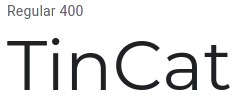

## Styleguide

## Colors
Based on this picture:

 

### Primary Accent color:

#### Red-Orange accents:
-  `#d91a60`
-  `#ec6a74`

#### Blue accents:
-  `#3e88c5`
-  `#25aae2`

#### Background:
-  `White`

## Fonts

- Pacifico: 

- Montserrat: 

